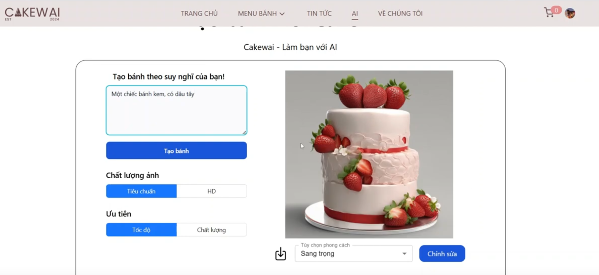

# 🎂 Cakewai – Go Backend API for AI-powered Cake E-commerce

This project is a RESTful backend API built using **Golang**, designed for an e-commerce application that sells cakes online. It incorporates **AI-driven insights and image generation** to enhance the shopping experience, offering personalized cake suggestions, trend analytics, and visual cake inspiration.

Built using a clean modular architecture with **Gin**, **MongoDB**, **Cloudinary**, and **Hugging Face**, this backend is ready for production and scalable deployments.




---

## 🚀 Features

- ✅ RESTful API structure
- 🔐 JWT Authentication (Access token and RefreshToken)
- 🗃️ MongoDB (via official Go driver)
- 🖼️ Image generation using Hugging Face APIs
- ☁️ Cloudinary for image uploading
- 🧠 Fine-grain AI prompting with Gemini
- 📁 Modular folder structure
- 🌱 Environment-based configuration
- 🛠️ Unit Testing support
- 🔑 Google OAuth (Login with Google)
- 📄 Swagger/OpenAPI support (optional)
- 🐳 Docker-ready
- 🌍 Deployable on [**DigitalOcean**](https://www.digitalocean.com/)

---

## 🧠 AI-Powered Business Analytics

Cakewai includes smart features to **boost sales and user engagement**:
- 🎨 **Visual Cake Generator**:
  - Let users type “a pastel galaxy cake” or “a birthday cake for a dog lover”
  - Hugging Face generates a cake image to inspire or personalize product listings

- 💡 **Fine-grain Prompting with Gemini**:
  - Generate product descriptions, ads, or flavor ideas
  - Auto-reply to customer queries using conversation summaries

---


## 🧰 Tech Stack

- [**Golang** `v1.21+`](https://golang.org/doc/)
- [**Gin** - Web framework](https://github.com/gin-gonic/gin)
- [**MongoDB** - NoSQL database](https://www.mongodb.com/)
- [**JWT** - JSON Web Tokens for Authentication](https://jwt.io/)
- [**Docker** - Containerization platform](https://www.docker.com/)
---


## 📁 Project Structure
```bash
cakewai/
├── api/                      # API layer (controllers, routing, middleware)
│   ├── handlers/             # Request handlers
│   ├── middlewares/          # Authentication, logging, CORS, etc.
│   └── routes/               # Route definitions
│
├── domain/                   # Domain models (schemas, DTOs)
│
├── infras/                   # Infrastructure (database connections, external services)
│   └── mongo/                # MongoDB setup and connection utilities
│
├── internals/                # Internal utility packages
│   ├── token_utils/          # JWT generation and verification
│   └── utils/                # Helper functions
│
├── repository/               # Data access layer
│
├── services/                 # Business logic layer
│
├── usecase/                  # Application use cases (orchestrating services)
│
├── main.go                   # App entry point
│
├── .env                      # Environment variable definitions
├── Dockerfile                # Docker config
├── .gitignore                # Git ignored files
├── go.mod                    # Go module definitions
├── go.sum                    # Go dependency checksums
└── README.md                 # This file
```
---

## 📦 Installation & Run (Local)

```bash
# Clone the project
git clone https://github.com/iseT1enLoc/cakewai.git

# Enter the project directory
cd cakewai

# (Optional) Set up environment variables
cp .env.example .env
# Then edit the .env file to include your MongoDB URI, JWT secrets, API keys, etc.

# Install dependencies
go mod tidy

# Run the application
go run main.go

```
---
## 📫 Contact

For any questions or feedback, feel free to reach out:

- GitHub: [@iseT1enLoc](https://github.com/iseT1enLoc)
- Email: locnvt.it@gmail.com


